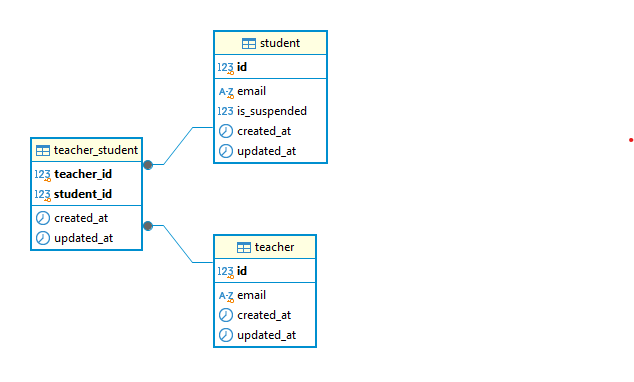
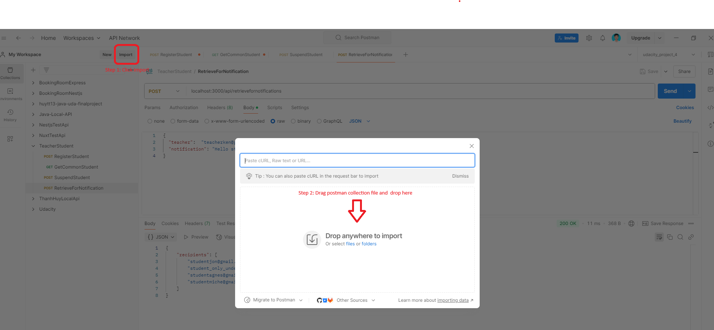

# Education Network Server

## Overview

Education Network is a backend server project built with Express.js.
The system provides APIs enabling teachers to manage their students through various unique features.

## Table Of Content

- [Overview](#overview)
- [Table Of Content](#table-of-content)
- [Approach](#approach)
  - [Technologies](#technologies)
  - [Generate source structure](#generate-source-structure)
  - [Choose a development method](#choose-a-development-method)
  - [Develop APIs and unit test](#develop-apis-and-unit-test)
  - [More ideas](#more-ideas)
- [Tech stacks](#tech-stacks)
- [Database structure](#database-structure)
- [Source structure](#source-structure)
- [How to run](#how-to-run)
  - [Pre-requisites](#pre-requisites)
  - [Installation](#installation)
  - [Environment setup](#environment-setup)
  - [Run docker compose](#run-docker-compose)
- [How to test](#how-to-test)
  - [1. Using swagger](#using-swagger-api)
  - [2. Import Postman collection](#import-postman-collection)
  - [Call the first api](#call-the-first-api)
- [Note](#note)
- [Contact](#contact)

## Features

- Teacher can register students (US1).
- Teacher can retrieve a list of students common to a given list of teachers (US2).
- Teacher can suspend a specified student (US3).
- Teacher can retrieve a list of students who can receive a given notification (US4).

## Approach

### Technologies

- Choose a library or framework to develop APIs.
- There are many options for this such as ExpressJS, NestJS, etc.

### Generate source structure

- Depend on requirement or project scope, choose a template or structure for this project.
- There are many options such as 3-layers architecture, module architecture, etc.

### Choose a development method

- Think about TDD (Test-driven development) or TLD (Test-Last development).

### Develop APIs and unit test

- Following the requirements, develop APIs to implement features.
- Write unit test to verify apis.

### More ideas

- Implement security with authentication, authorization.
- Tracing with log.
- Deploy app.

## Tech stacks

- **Backend Framework**: ExpressJS
- **Database**: MySQL with Sequelize
- **Testing**: Jest

## Database structure



## Source structure

```tree
...
├── src
│   ├── configs
│   ├── constants
│   ├── controllers
│   │   ├── TeacherController.ts
│   ├── dtos
│   │   ├── CommonStudent.dto.ts
│   │   ├── RegisterStudent.dto.ts
│   │   ├── RetrieveForNotification.dto.ts
│   │   ├── SuspendStudent.dto.ts
│   ├── models
│   │   ├── index.ts
│   │   ├── StudentModel.ts
│   │   ├── TeacherModel.ts
│   │   ├── TeacherStudentModel.ts
│   ├── routes
│   │   ├── index.ts
│   │   ├── TeacherRoute.ts
│   ├── seeds
│   │   ├── SeedDatats
│   ├── services
│   │   ├── TeacherService.ts
│   ├── utils
│   │   ├── CustomError.ts
│   ├── index.ts
│   ├── test
│   │   ├── controllers
│   │       ├── TeacherController.test.ts
│   │   ├── services
│   │       ├── TeacherService.test.ts
```

## How to run

### Pre-requisites

- Node.js v20.17.0
- Docker
- Postman

### Installation

To install the project, follow these steps:

```bash
git clone https://github.com/thanhhuy1999/education-network
```

### Environment setup

To run this project, you will need to set up the following environment variables. You can do this by creating a `.env` file in root folder.

```plaintext
PORT=3000
NODE_ENV=development

DB_USERNAME=your_username
DB_PASSWORD=your_password
DB_ROOT_PASSWORD=root_password
DB_NAME=your_db_name
DB_HOST=localhost
DB_PORT=3306
DB_DIALECT=mysql

```

### Run docker compose

At root folder, to build, start and run services:

```bash
npm run docker-up
```

After you run the command, mysql database was created and express server was ran and mock data was created successfully

### Run test

To run tests:

```bash
npm run test
```

## How to test

### Using swagger api

I already implement swagger api docs for this project and you can use this for test
Go to: http://localhost:3000/api-docs and test api what you want

### Import Postman collection

Import the content of [Postman File](./TeacherStudent.postman_collection.json) to Postman following guide.
.

### Call the first api

Call the first api to get response.

## Note

- Following the requirement, I didn't create the API for registering a specific teacher or a specific student. Please run the docker-compose first to initial all thing what we need to run this project.
- Attach the postman file: [Postman File](./TeacherStudent.postman_collection.json)

## Contact

- Email: thanhhuy1999.uet@gmail.com
- Github: thanhhuy1999
